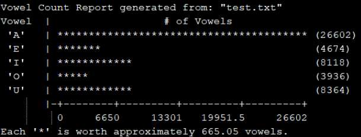

## Vowel Analysis - Tyler Hippard

Requires: n/a

Steps to use the Number Magnifier
  1. Download the files in this subfolder, and compile with your favourite c++ compiler.
  2. Enter the location of a text file to read.
  3. The program will output an ASCII graph to '(filename)-analysis.txt'
  
Here's an example of the analysis file

Usage Example: https://www.youtube.com/watch?v=3BwTPnDnGAw
