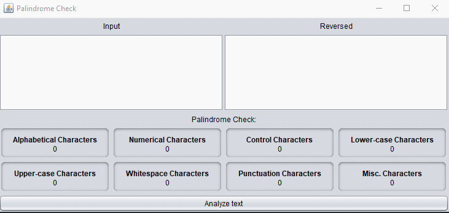

## Palindrome Check - Tyler Hippard
*Also lists all of the character types too, why not?*

Requires: Java

Steps to use the Palindrome Check
  1. [Download the compiled binary](https://github.com/JellyBlade/programming-examples/releases/palindrome), or download the files in this subdirectory and compile yourself with your favourite java compiler.
  2. Enter some text in the left pane
  3. Click "Analyze Text"
  

