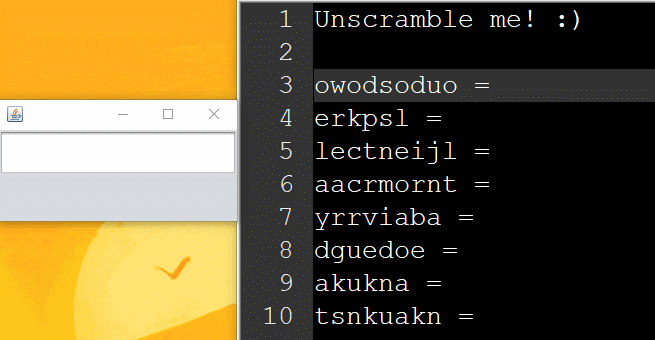

## Pokemon Unscrambler - Tyler Hippard
*Just a quick program I whipped up in a couple hours, and it shows*

Requires: Java, pokemon.txt

Steps to use the Pokemon Unscrambler
  1. [Download the compiled binary](https://github.com/JellyBlade/programming-examples/releases/tag/v0.1), or download the files in this subdirectory and compile yourself with your favourite java compiler. 'pokemon.txt' must be in the same directory.
  2. Enter the scrambled name of a pokemon
  3. If the name is recognized/valid/the stars align, the unscrambled name of the pokemon will be shown below, and copied to your clipboard.
  

